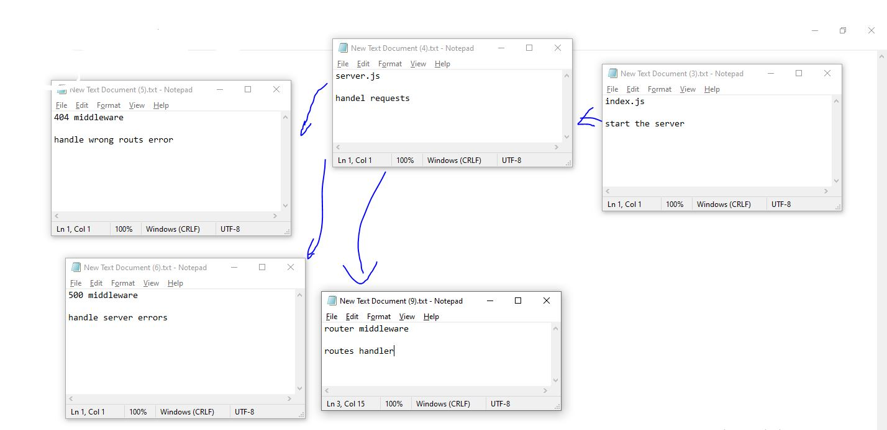

# LAB - Class 14

## Project: Auth-server

### Author: Ruwaid al sayyed obeid

### Links and Resources

- [submission PR](https://github.com/ruwaid-401-advanced-javascript/auth-server/pull/4)
- [Github actions](https://github.com/ruwaid-401-advanced-javascript/auth-server/pull/4/checks)

### Documentaion
* EndPoint: `/docs` 

## Modules
### server.js
### 404.js
### 500.js
### extraroute

### Setup
#### .env requirements
* PORT - Port Number
* MONGODB_URI - URL to the running mongo instance/db
* SECRET - to generate accses token
* CLIENT_ID - github client id
* CLIENT_SECRET - github client secret

#### How to initialize/run your application 
* `npm start`
* EndPoint: `/` 
* EndPoint: `/login` 
* EndPoint: `/docs` 
* EndPoint: `/users` 
* EndPoint: `/secret` --> need token
* EndPoint: `/signin` 
* EndPoint: `/signup` 
* EndPoint: `/read` 
* EndPoint: `/add` 
* EndPoint: `/change` 
* EndPoint: `/remove` 

#### How to use your library 
#### Tests
- Lint test: `npm run lint`
- unit test: `npm test`

#### UML

